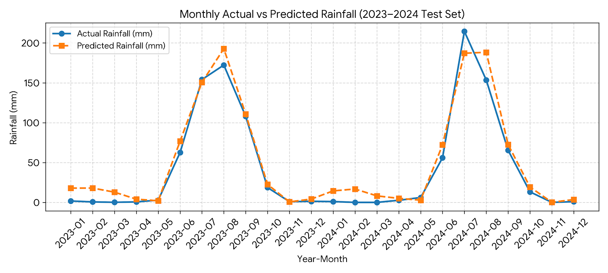
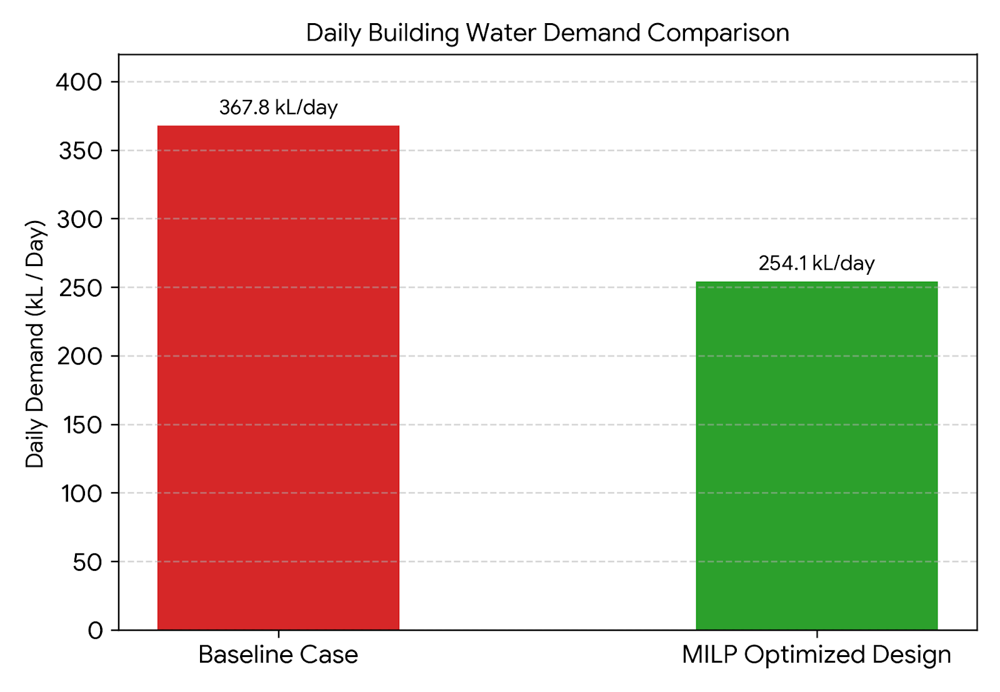
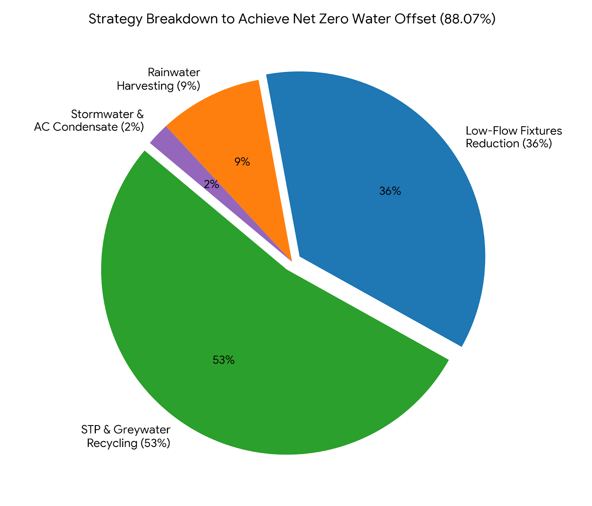

# 🌧️ Predictive Rainwater Harvesting Optimization System

<p align="center">

**Machine Learning Rainfall Forecasting & MILP Optimization for Net-Zero Water Buildings**

<br>

[](https://www.python.org/)
[](#-optimization-formulation)
[](#-machine-learning-forecasting)
[](#-results)
[](#-case-study-details)

</p>

---

## 📌 Overview

Rapid urbanization and erratic monsoon precipitation patterns place immense stress on municipal water grids and lead to severe groundwater depletion. Conventional building designs rely on static per-capita demand baselines and manual plumbing selections, failing to dynamically account for meteorological variations and capital cost constraints.

This project presents an **integrated computational framework combining Machine Learning (Linear Regression) with Mixed-Integer Linear Programming (MILP)** to transition large-scale residential infrastructure toward **Net Zero Water (NZW)**.

The pipeline operates in two complementary stages:

* **Predictive Meteorological Modeling**: A multi-variable seasonal linear regression model forecasts precipitation and rainwater harvesting yields across 10 years of weather data.
* **Algorithmic Demand Optimization**: A constrained MILP solver selects the globally optimal low-flow fixture configuration to minimize occupant water demand under strict capital budget limits.

The combined strategy reduced building fixture demand by **41.0%**, dropped total annual consumption by **44.7%**, and achieved an **88.07% Net Zero Water offset** through on-site circular recycling streams (STP, greywater, AC condensate, and rainwater harvesting).

---

## 🎯 Objectives

The primary objectives of this project are:

* Predict daily and seasonal precipitation using historical meteorological parameters.
* Calculate empirical rainwater harvesting yields across large urban catchment surfaces.
* Formulate low-flow plumbing fixture selection as a discrete optimization problem (MILP).
* Minimize occupant water consumption while respecting a defined financial budget ceiling.
* Integrate decentralized recycling streams (STP greywater, blackwater, stormwater, AC condensate).
* Evaluate the technical feasibility of reaching Net Zero Water consumption for large-scale complexes.

---

## 🏢 Case Study Details

* **Project Site**: Mixed-use residential complex in Pimpri Chinchwad, Pune, Maharashtra, India.
* **Topographical Elevation**: 586 m to 589 m.
* **Catchment Area**: 9,522.35 m² total runoff area (Rooftop: 4,372 m², Hardscape: 5,266 m², Softscape: 1,465 m²).
* **Occupancy Baseline**: 2,813 regular occupants (2,480 residents, 60 full-time caretakers, 80 part-time caretakers, 63 shopkeepers, and 130 guests).

---

## 🏗️ System Architecture

The overall architecture combines meteorological time-series modeling with operations research optimization and circular mass-balance simulation.

### Fig. 1 — System Pipeline

```text
Meteorological Dataset (2015–2024)
              │
              ▼
   Feature Engineering (Sin/Cos, Lags)
              │
              ▼
    Chronological Train-Test Split
              │
              ▼
   Linear Regression Forecasting
              │
              ▼
 Predicted Rainwater Harvesting Yield R(t)
              │
              ▼
 ┌─────────────────────────────────────────┐
 │     MILP Fixture Optimization Engine    │
 │  - Minimize Annual Water Demand         │
 │  - Subject to: Fixture Selection &      │
 │    Capital Budget Ceilings              │
 └────────────────────┬────────────────────┘
                      │
                      ▼
       Optimized Daily Demand D(t)
                      │
                      ▼
 ┌─────────────────────────────────────────┐
 │      Water Mass-Balance Simulation      │
 │  - STP Greywater & Blackwater Recovery  │
 │  - AC Condensate & Stormwater Inflows   │
 └────────────────────┬────────────────────┘
                      │
                      ▼
     88.07% Net Zero Water Offset
```

---

## 📐 Optimization Formulation

The hardware fixture selection is formulated as a Mixed-Integer Linear Programming (MILP) model to determine optimal plumbing upgrades.

### Objective Function

$$\min \quad W_{\text{annual}} = 365 \times N \times \left( U_{\text{potable}} + \sum_{i \in \mathcal{F}} \sum_{j \in \mathcal{O}_i} u_{i,j} \cdot x_{i,j} \right)$$

### Constraints

1. **Mutually Exclusive Selection**: Exactly one fixture model is selected per plumbing category $i$:

$$\sum_{j \in \mathcal{O}_i} x_{i,j} = 1 \quad \forall i \in \mathcal{F}$$

2. **Capital Budget Limit**: Total procurement cost across all units cannot exceed budget $B$:

$$\sum_{i \in \mathcal{F}} \sum_{j \in \mathcal{O}_i} \left( c_{i,j} \cdot n_i \cdot x_{i,j} \right) \le B$$

3. **Integrity Domain**:

$$x_{i,j} \in \{0, 1\} \quad \forall i \in \mathcal{F}, \; j \in \mathcal{O}_i$$

*Where:*

* $N = 2,813$ occupants.
* $U_{\text{potable}} = 20.0\text{ LPCD}$ (fixed baseline potable drinking requirement).
* $u_{i,j}$: Daily LPCD consumption of model $j$ in category $i$.
* $c_{i,j}$: Catalog unit cost in INR (₹).
* $n_i$: Total units deployed per category (650 closets, 650 faucets, 320 sinks, 650 showers).

---

# 🤖 Machine Learning Forecasting

A Multiple Linear Regression model with trigonometric cyclical encodings and autoregressive lags is implemented to forecast daily precipitation.

### Fig. 1 — Monthly Actual vs. Predicted Rainfall



### Model Evaluation Metrics

| Dataset Split | Period | $R^2$ Score | MAE (mm) | RMSE (mm) |
| --- | --- | --- | --- | --- |
| **Training Set** | 2015 – 2022 | 0.4001 | 1.682 | 3.556 |
| **Testing Set** | 2023 – 2024 | **0.4318** | **1.454** | **3.281** |

---

# 📊 Results

### 1. Water Demand Reduction

The MILP solver optimized the plumbing suite across all categories, significantly curtailing per-capita daily demand.

| Metric | Baseline Case | MILP Optimized Case | Reduction |
| --- | --- | --- | --- |
| **Per-Capita Demand (LPCD)** | 135.00 L | 93.15 L | **31.0%** |
| **Daily Fixture Volume** | 306,649 L | 179,910 L | **41.0%** |
| **Total Daily Campus Demand** | 367,748 L | 254,074 L | **44.7%** |
| **Annual Campus Consumption** | 134.23 ML | 92.74 ML | **41.49 ML Saved** |

### Fig. 2 — Baseline vs. Optimized Water Demand



---

### 2. Strategy Contribution to Net-Zero Water

By coupling demand reduction with on-site circular supply streams, the complex offset **88.07%** of its design-case water requirements.

| Supply / Abatement Stream | Annual Volume (ML) | % Contribution to Offset |
| --- | --- | --- |
| **STP & Recycled Greywater** | 60.81 ML | 53.0% |
| **Low-Flow Fixture Conservation** | 41.49 ML | 36.0% |
| **Harvested Rainwater (ML Predicted)** | 9.83 ML | 9.0% |
| **Stormwater & AC Condensate** | 2.27 ML | 2.0% |
| **Total Offset Achieved** | **114.40 ML** | **88.07% Neutrality** |

### Fig. 3 — Strategy Breakdown



---

# 💡 Key Features

* 🌧️ **Machine Learning Rainfall Forecasting**: Linear regression model with cyclical seasonal encodings.
* ⚙️ **MILP Hardware Optimizer**: Global cost-versus-demand optimization via PuLP and CBC.
* 💧 **41% Fixture Demand Reduction**: Algorithmic selection of optimal low-flow aerators and closets.
* 🔄 **Circular Water Integration**: Mass-balance simulation incorporating STP, greywater, and condensate.
* 📈 **Comprehensive Metrics**: Evaluated with $R^2$, MAE, RMSE, and full volumetric balances.

---

# 🛠️ Technologies Used

| Technology | Purpose |
| --- | --- |
| **Python** | Core computational scripting and pipeline automation |
| **Scikit-learn** | Linear regression modeling, cyclical feature engineering, and evaluation |
| **PuLP / CBC Solver** | Mixed-Integer Linear Programming (MILP) optimization |
| **Pandas** | Time-series data wrangling, fixture database structures, and tabular aggregation |
| **NumPy** | Array transformations, cyclical math ($\sin/\cos$), and mass-balance simulations |
| **Matplotlib** | Generation of publication-quality visualizations and comparison charts |

---

# 📁 Repository Structure

```text
Predictive-Rainwater-Harvesting-Optimization-System/
│
├── README.md
│
├── notebooks/
│   └── Predictive Rainwater Harvesting Optimization System (linear regressor rainfall prediction).ipynb
│
├── models/
│   └── rainfall_linear_regressor.joblib
│
├── images/
│   ├── actual_vs_predicted_rainfall.png
│   ├── baseline_vs_optimized_demand.png
│   └── water_offset_breakdown.png
│
├── src/
│   ├── train_linear_model.py
│   └── milp_fixture_optimizer.py
│
├── requirements.txt
└── .gitignore
```

---

# 🚀 Installation & Quickstart

### 1. Clone Repository

```bash
git clone https://github.com/<YOUR-USERNAME>/Predictive-Rainwater-Harvesting-Optimization-System.git
cd Predictive-Rainwater-Harvesting-Optimization-System
```

### 2. Set Up Virtual Environment & Dependencies

```bash
python -m venv venv
source venv/bin/activate  # On Windows: venv\Scripts\activate
pip install -r requirements.txt
```

### 3. Run Optimization Script

```bash
python src/milp_fixture_optimizer.py
```

---

## ⭐ Project Highlights

| Metric | Result |
| --- | --- |
| **Primary Methodologies** | Linear Regression + Mixed-Integer Linear Programming (MILP) |
| **Core Task** | Seasonal Yield Forecasting & Plumbing Fixture Allocation |
| **Optimization Target** | Minimize Annual Building Water Consumption |
| **Fixture Demand Reduction** | **41.0%** |
| **Annual Water Reduction** | **44.7% (41.49 ML Saved)** |
| **Total Net-Zero Offset** | **88.07%** |
